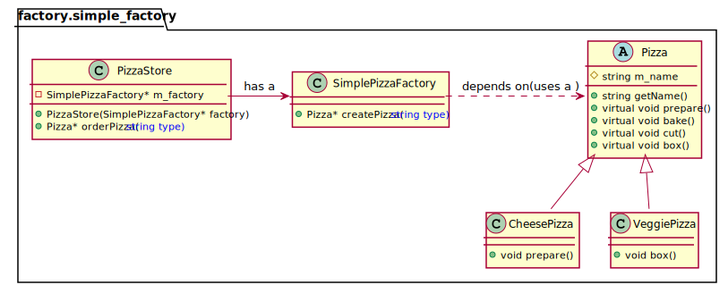

# Simple Factory Pattern
简单工厂模式：封装对象创建。如果需要根据不同的条件创建不同的对象，把这块代码封装成一个SimpleFactory类，便于后续扩展，实现业务代码和对象创建的解耦。即把对象的创建委托给SimpleFactory。

# Class diagram for Simple Factory pattern

# 参考资料
https://www.youtube.com/watch?v=EcFVTgRHJLM&list=PLrhzvIcii6GNjpARdnO4ueTUAVR9eMBpc&index=4

