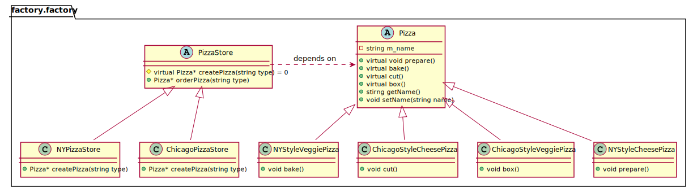

# Factory Pattern
工厂模式：定义了一个创建对象的接口，但由子类来决定要实例化的是哪一个类。工厂方法让实例化推迟到了子类。

决定的意思是：选择使用哪个子类，自然就决定了实际创建的产品是什么。并不是指运行时可以做决定。

## 简单工厂模式和工厂模式的区别
虽然每个具体的PizzaSotre看起来都像是SimplePizzaFactory。但是这里每个具体的PizzaStore都扩展自一个类:PizzaStore

工厂方法创建了一个框架， 让子类决定如何实现；

orderPizza()方法提供了一般的框架，以便创建Pizza；

orderPizza()方法依赖工厂创建具体的类，并创造出具体的pizza。

简单工厂，只不过是把对象的创建封装了起来，但不具备工厂所具备的弹性。

# Class diagram for Factory pattern

# 参考资料
https://www.youtube.com/watch?v=EcFVTgRHJLM&list=PLrhzvIcii6GNjpARdnO4ueTUAVR9eMBpc&index=4

